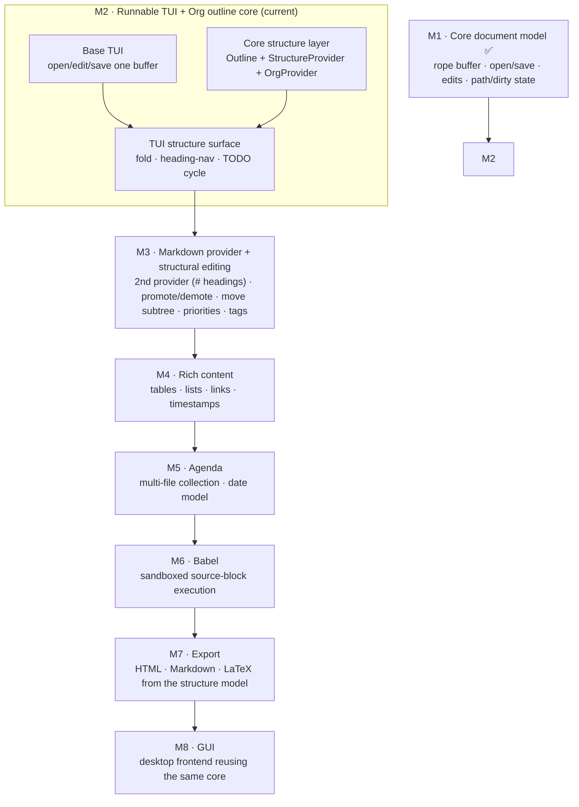

# textr-org roadmap

> The long view. Individual milestones get their own living design doc (e.g.
> [`milestone-2-tui.md`](milestone-2-tui.md)); this file is the map they sit on and the
> record of where textr is headed.

## North star — Org-mode–class structure editing, for any format

textr is a from-scratch gedit clone built to learn Rust, but its *editing model* aims higher
than gedit's: **structure-aware editing in the spirit of Emacs Org mode, applied to any
format** — Org first, Markdown next, more later. Concretely, the north star is:

- **Outline / folding** — a document is a tree of headings you can fold, expand, and navigate.
- **TODO workflow** — cycle `TODO`/`DONE` (and, later, custom keyword sets, priorities, tags)
  on any heading.
- **Structural editing** — promote/demote a heading, move a subtree up/down, insert siblings
  and children — editing the *tree*, not just the text.
- **Rich content** — tables that recalculate, lists, links, and timestamps as first-class data.
- **Agenda** — collect scheduled/deadline/TODO items across many files into one view.
- **Babel** — execute source blocks in place and capture their results.
- **Export** — render the structure model to HTML / Markdown / LaTeX and beyond.

The design bet that makes this tractable for a learning project: **all of it hangs off one
format-agnostic structure layer in the headless core** (`structure::{Outline, Heading,
TodoState}` behind a `StructureProvider` trait). Each format — Org, then Markdown — is one
provider implementing that trait; every capability above is written once against the trait and
works for every format. This mirrors how gedit/GtkSourceView abstract over languages, and it
keeps the core UI-agnostic, so the terminal frontend and the future desktop GUI both get
structure for free.

## Milestone map

### M1 — Core document model *(done)*
Rope-backed `Document` with open/save/*Save As*, char-indexed edits, a modified flag, typed
I/O errors, and read-only line/char accessors. Fully unit-tested, no frontend.

### M2 — Runnable TUI + Org outline core *(current)*
The first runnable program: a terminal editor that opens, moves, edits, and saves **one**
buffer, **plus** the first cut of the structure layer — an Org `StructureProvider` in core and
a TUI surface for folding, heading navigation, and `TODO`/`DONE` cycling. This is where the
north-star architecture is laid down. Full design: [`milestone-2-tui.md`](milestone-2-tui.md).

### M3 — Markdown provider + structural editing
The **fast-follow that proves the trait is genuinely format-agnostic**: a second
`StructureProvider` for Markdown (`#` ATX headings), landing alongside the first structural
edits — promote/demote a heading, move a subtree up/down, insert sibling/child headings — plus
TODO priorities and tags. Both formats exercise the same operations from day one.

### M4 — Rich content
Tables (with recalculation), lists, inline markup, links, and `SCHEDULED`/`DEADLINE`
timestamps parsed as data rather than plain text.

### M5 — Agenda
Multi-buffer/multi-file support and a date model, so timestamped and TODO items across files
collect into a single agenda view — the first capability that reaches beyond one buffer.

### M6 — Babel
Executable source blocks with captured results, run in a sandbox. This is the first milestone
that runs untrusted code, so its threat model is designed up front, not bolted on.

### M7 — Export
Render the structure model to HTML, Markdown, and LaTeX. Because export reads the same
`Outline`/content model every provider feeds, one exporter serves every input format.

### M8 — GUI
A desktop frontend (gtk4-rs) reusing the **same** core *and* the same driver-agnostic state and
render logic (see [`architecture.md`](architecture.md)); only the input/output driver is new.

## Why this order

Each milestone ends in a runnable program and unblocks the next: you cannot fold what you
cannot parse (M2 structure needs M1's buffer); a second provider (M3) is what validates the
trait before more capabilities pile on it; agenda (M5) needs multi-file, which needs the tab/
document machinery M3–M4 grow into; babel and export (M6–M7) consume the content model M4
establishes. Full Org is the destination — reached deliberately, one runnable step at a time,
never in one leap onto an editor that cannot yet save.
