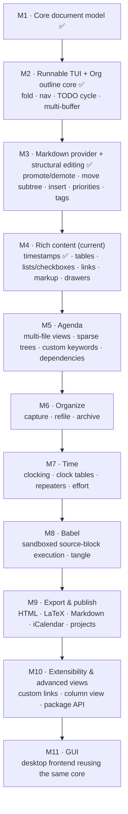

# torg roadmap

> The long view. Individual milestones get their own living design doc (e.g.
> [`milestone-2-tui.md`](milestone-2-tui.md)); this file is the map they sit on and the
> record of where textr is headed.

## North star — Org-mode–class structure editing, for any format

textr is a from-scratch gedit clone built to learn Rust, but its *editing model* aims higher
than gedit's: **structure-aware editing in the spirit of Emacs Org mode, applied to any
format** — Org first, Markdown next, more later. The destination is the full core feature set
of [Org mode](https://orgmode.org/features.html) (the [manual](https://orgmode.org/org.html)
is the reference for exact semantics); the coverage map below shows where each feature lands.

The design bet that makes this tractable for a learning project: **all of it hangs off one
format-agnostic structure layer in the headless core** (`structure::{Outline, Heading,
TodoState}` behind a `StructureProvider` trait). Each format — Org, then Markdown — is one
provider implementing that trait; every capability is written once against the trait and
works for every format. This mirrors how gedit/GtkSourceView abstract over languages, and it
keeps the core UI-agnostic, so the terminal frontend and the future desktop GUI both get
structure for free.

## Org feature coverage map

Every feature from [orgmode.org/features.html](https://orgmode.org/features.html) and the
manual's core chapters, and the milestone that owns it. ✅ = shipped.

| Org feature | Milestone |
|---|---|
| Outline: folding, tree navigation | M2 ✅ |
| TODO keywords: basic `TODO`/`DONE` cycling | M2 ✅ |
| Multiple files in one session (buffers, switching) | M2 ✅ (landed early) |
| Second format (Markdown) through the same trait | M3 ✅ |
| Structure editing: promote/demote, move subtree, insert headings | M3 ✅ |
| Priorities (`[#A]`), tag syntax + tag editing | M3 ✅ |
| Plain lists: bullets, checkboxes, `[1/3]` statistics cookies | M4 |
| Tables: editor with alignment + spreadsheet formulas | M4 |
| Hyperlinks: `[[link][desc]]`, internal + external, follow | M4 |
| Timestamps: active/inactive, `SCHEDULED`/`DEADLINE`, ranges + repeaters (parsed) | M4 ✅ |
| Inline markup: emphasis, verbatim, sub/superscript | M4 |
| Drawers and `PROPERTIES` | M4 |
| Agenda views: day/week, multi-file collection | M5 |
| TODO-list view, tag/property match, search view | M5 |
| Sparse trees | M5 |
| Custom TODO keyword sets + state-change logging | M5 |
| Tag inheritance, task dependencies | M5 |
| Capture with templates | M6 |
| Refile and archive subtrees | M6 |
| Repeating tasks (timestamp repeaters) | M7 |
| Clocking: clock in/out, clock tables (time reports) | M7 |
| Effort estimates, timers | M7 |
| Babel: execute source blocks, capture results, tangle | M8 |
| Export: HTML, LaTeX, Markdown, iCalendar | M9 |
| Publishing projects (batch export), CSV table import/export | M9 |
| Column view over properties | M10 |
| Custom link types, speed keys, extension/package API | M10 |
| LaTeX fragment display | M10 |

## Milestone map

### M1 — Core document model *(done)*
Rope-backed `Document` with open/save/*Save As*, char-indexed edits, a modified flag, typed
I/O errors, and read-only line/char accessors. Fully unit-tested, no frontend.

### M2 — Runnable TUI + Org outline core *(done)*
The first runnable program: a terminal editor that opens, moves, edits, and saves buffers,
plus the first cut of the structure layer — an Org `StructureProvider` in core and a TUI
surface for folding, heading navigation, and `TODO`/`DONE` cycling. Multi-buffer support
(several files per session, cycling, a buffer list, close/quit guards) landed here too,
ahead of its original M5 slot. Full design: [`milestone-2-tui.md`](milestone-2-tui.md).

### M3 — Markdown provider + structural editing *(done)*
The **fast-follow that proves the trait is genuinely format-agnostic**: a second
`StructureProvider` for Markdown (`#` ATX headings), landing alongside the first structural
edits — promote/demote a heading or subtree, move a subtree up/down, insert sibling headings —
plus TODO priorities (`[#A]`/`[#B]`/`[#C]`) and tag syntax with a tag-editing prompt. Both
formats exercise the same operations from day one.

*Status: **shipped**, in two halves. `MarkdownProvider` (fence-aware ATX parsing) plus
`Format`/`detect_format` select structure per buffer by extension; then the structural-edit
operations landed as `StructureProvider` default methods over two per-format primitives
(marker byte, max level) — written once, working identically in Org and Markdown, which is
the "second provider validates the trait" bet fully cashed in.*

### M4 — Rich content *(in progress)*
Everything inside an entry parsed as data rather than plain text: tables (editor with column
alignment, then spreadsheet formulas and recalculation), plain lists with checkboxes and
`[1/3]`/`[50%]` statistics cookies, hyperlinks (`[[target][description]]`, internal and
external, follow-link), active/inactive timestamps with `SCHEDULED`/`DEADLINE`, inline markup
(emphasis, verbatim, sub/superscript), and drawers including `PROPERTIES`.

*Status: **timestamps shipped** — the full grammar (active/inactive, time, time/date ranges,
`+`/`++`/`.+` repeaters and `-`/`--` warnings) parses into a `Timestamp` model, planning lines
(`SCHEDULED:`/`DEADLINE:`) attach to headings, and the TUI sets them, inserts timestamps, and
shifts the field under the cursor (`Shift+↑/↓`, overloaded with priority the way Org does).
Tables, lists, links, markup, and drawers remain.*

### M5 — Agenda
The date model meets the multi-file machinery: timestamped and TODO items across files
collect into day/week agenda views, a global TODO list, tag/property match and search views,
and in-buffer sparse trees. Custom TODO keyword sets with state-change logging, tag
inheritance, and task dependencies land here, since the agenda is what makes them visible.

### M6 — Organize
Moving entries around their lifecycle: capture (quick entry via templates into target files),
refile (send a subtree to a chosen heading, across buffers), and archive (move finished
subtrees to archive files). Builds directly on M3's subtree operations.

### M7 — Time
The clock: repeating tasks via timestamp repeaters, clock in/out on any entry, clock tables
(customizable time reports), effort estimates, and countdown/relative timers.

### M8 — Babel
Executable source blocks with captured results and tangling (extract code files from
documents). This is the first milestone that runs untrusted code, so its threat model is
designed up front, not bolted on.

### M9 — Export & publish
Render the structure model to HTML, LaTeX, Markdown, and iCalendar; publishing projects batch
many files to a target; tables import/export CSV. Because export reads the same
`Outline`/content model every provider feeds, one exporter serves every input format.

### M10 — Extensibility & advanced views
The open-ended tier: custom link types (`issue:74`-style, with user-defined resolution),
column view over properties, LaTeX fragment display, speed keys, and the package/extension
API over a stable core — the point where `torg`'s capabilities are meant to become
installable packages (see the `textr` sibling project's plan).

### M11 — GUI (desktop and mobile)
Graphical frontends reusing the **same** core — a desktop app (gtk4-rs) and a native
iPad/iOS app (SwiftUI) — each reusing `torg-core` unchanged; only the input/output driver is
new (see [`architecture.md`](architecture.md)).

*Status: a **spike** for the iPad direction is in [`ios/`](../ios/) — `torg-core` compiled for
iOS and bridged to SwiftUI through the [`torg-ffi`](../crates/ffi) UniFFI crate, driving a
touch view that renders the outline and cycles TODOs. It validates the "headless core on
mobile" pipeline; the full frontend (persistence, a real editing surface, a touch-native
command model) is the milestone's remaining work.*

## Why this order

Each milestone ends in a runnable program and unblocks the next: you cannot fold what you
cannot parse (M2 structure needs M1's buffer); a second provider (M3) is what validates the
trait before more capabilities pile on it; agenda (M5) needs the timestamps and metadata M4
parses; capture/refile (M6) reuse M3's subtree machinery; clocking and repeaters (M7) need
M4's date model; babel and export (M8–M9) consume the content model M4 establishes; and the
extensibility tier (M10) needs a core API those years of features have stabilized. Full Org
is the destination — reached deliberately, one runnable step at a time, never in one leap
onto an editor that cannot yet save.
